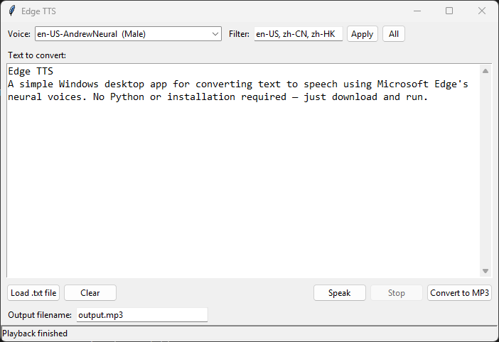

# Edge TTS

A simple Windows desktop app for converting text to speech using Microsoft Edge's neural voices. No Python or installation required — just download and run. Generate your own high quality speech from text without paying for service. 

[▶ Listen to sample](sample.mp3)

## Download

Grab `EdgeTTS.exe` from this folder and run it.

## Features

- 400+ neural voices across dozens of languages
- Filter voices by locale (e.g. `en-US`, `zh-CN`, `zh-HK`)
- Type text directly or load a `.txt` file
- Preview audio with the **Speak** button before saving — voice generation takes just seconds
- Export to MP3 with a custom filename

## How to Use

1. Launch `EdgeTTS.exe`
2. Wait a moment for voices to load
3. Pick a voice from the dropdown (filter by locale if needed)
4. Type or paste your text, or click **Load .txt file**
5. Click **Speak** to preview, or **Convert to MP3** to save

The MP3 is saved in the same folder as the `.exe`.

## Requirements

- Windows 10 or 11 (64-bit)
- Internet connection (voices are generated via Microsoft's servers)

## Windows SmartScreen Warning

On first launch you may see a "Windows protected your PC" warning because the app isn't code-signed. This is normal for unsigned executables.

To run it: click **More info** → **Run anyway**

## Voices

The default filter shows `en-US`, `zh-CN`, and `zh-HK` voices. You can type any locale code (or multiple, comma-separated) into the Filter box and click **Apply**. Click **All** to see every available voice.

Examples:
- `en-GB` — British English
- `ja-JP` — Japanese
- `ko-KR` — Korean
- `fr-FR` — French

## Support

If you find this useful, consider buying me a coffee!

